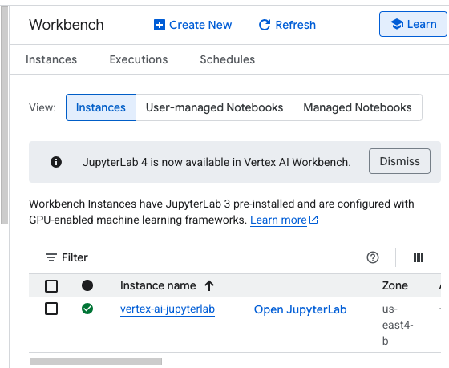
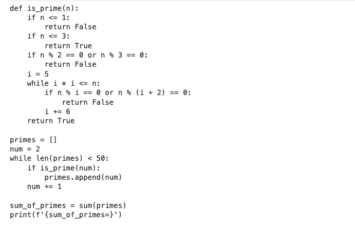
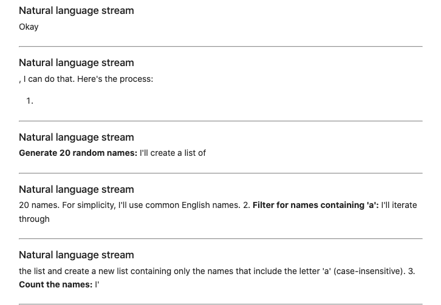
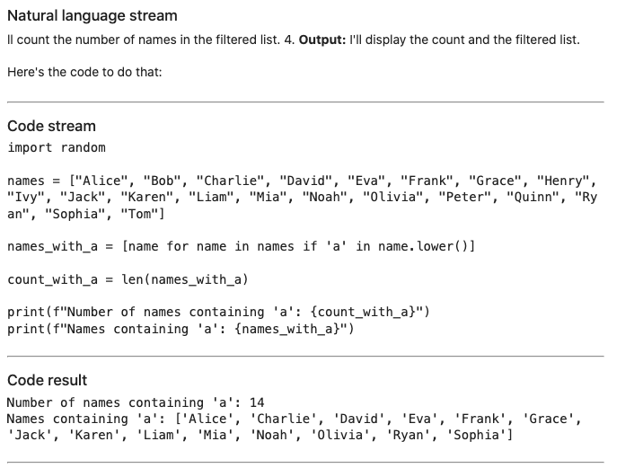
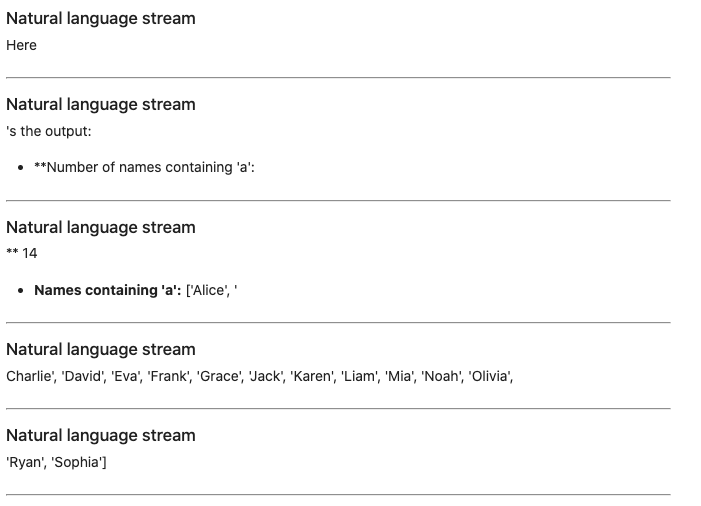

# GCP-Lab-Intro-to-Generating-and-Executing-Python-Code-with-Gemini-2.0
Intro to Generating and Executing Python Code with Gemini 2.0


#### Overview
This lab introduces the code execution capabilities of the Gemini 2.0 Flash model, a new multimodal generative AI model from Google DeepMind. Gemini 2.0 Flash offers improvements in speed, quality, and advanced reasoning capabilities including enhanced understanding, coding, and instruction following.

A key feature of this model is code execution, which is the ability to generate and execute Python code directly within the API. If you want the API to generate and run Python code and return the results, you can use code execution as demonstrated in this lab.

This code execution capability enables the model to generate code, execute and observe the results, correct the code if needed, and learn iteratively from the results until it produces a final output. This is particularly useful for applications that involve code-based reasoning such as solving mathematical equations or processing text.


#### Gemini
Gemini is a family of powerful generative AI models developed by Google DeepMind, capable of understanding and generating various forms of content, including text, code, images, audio, and video.

#### Gemini API in Vertex AI
The Gemini API in Vertex AI provides a unified interface for interacting with Gemini models. This allows developers to easily integrate these powerful AI capabilities into their applications. For the most up-to-date details and specific features of the latest versions, please refer to the official Gemini documentation.

#### Gemini Models
- Gemini Pro: Designed for complex reasoning, including:
. Analyzing and summarizing large amounts of information.
. Sophisticated cross-modal reasoning (across text, code, images, etc.).
. Effective problem-solving with complex codebases.
- Gemini Flash: Optimized for speed and efficiency, offering:
. Sub-second response times and high throughput.
. High quality at a lower cost for a wide range of tasks.
. Enhanced multimodal capabilities, including improved spatial understanding, new output modalities (text, audio, images), and native tool use (Google Search, code execution, and third-party functions).

##### Prerequisites
- Before starting this lab, you should be familiar with:

. Basic Python programming.
. General API concepts.
. Running Python code in a Jupyter notebook on Vertex AI Workbench.


#### Objectives
In this lab, you will learn how to generate and execute code using the Gemini API in Vertex AI and the Google Gen AI SDK for Python with the Gemini 2.0 Flash model.

You will complete the following tasks:

- Generating and running sample Python code from text prompts
- Exploring data using code execution in multi-turn chats
- Using code execution in streaming sessions


### Task 1. Open the notebook in Vertex AI Workbench
1. In the Google Cloud console, on the Navigation menu (Navigation menu icon), click Vertex AI > Workbench.

2. Find the vertex-ai-jupyterlab instance and click on the Open JupyterLab button.

The JupyterLab interface for your Workbench instance opens in a new browser tab.





### Task 2. Set up the notebook

1. Open the intro_code_execution file.

2. In the Select Kernel dialog, choose Python 3 from the list of available kernels.

3. Run through the Getting Started and the Import libraries sections of the notebook.

. For Project ID, use qwiklabs-gcp-00-fbe115735fe3, and for Location, use us-east4.


#### Getting started
##### Install Google Gen AI SDK for Python

`%pip install --upgrade --quiet google-genai`

##### Import libraries

```
import os

from IPython.display import Markdown, display
from google import genai
from google.genai.types import GenerateContentConfig, Tool, ToolCodeExecution
```

##### Connect to a generative AI API service
Google Gen AI APIs and models including Gemini are available in the following two API services:

. Google AI for Developers: Experiment, prototype, and deploy small projects.
. Vertex AI: Build enterprise-ready projects on Google Cloud. The Google Gen AI SDK provides a unified interface to these two API services.

This notebook shows how to use the Google Gen AI SDK with the Gemini API in Vertex AI.


##### Set Google Cloud project information and create client
To get started using Vertex AI, you must have an existing Google Cloud project and enable the Vertex AI API.

Learn more about setting up a project and a development environment.

```
PROJECT_ID = "qwiklabs-gcp-00-fbe115735fe3"  # @param {type: "string", placeholder: "[your-project-id]", isTemplate: true}
if not PROJECT_ID or PROJECT_ID == "qwiklabs-gcp-00-fbe115735fe3":
    PROJECT_ID = str(os.environ.get("GOOGLE_CLOUD_PROJECT"))

LOCATION = os.environ.get("GOOGLE_CLOUD_REGION", "us-east4")
```

`client = genai.Client(vertexai=True, project=PROJECT_ID, location=LOCATION)`


### Task 3. Working with code execution in Gemini 2.0
In this section, you will use the Gemini API to generate and execute Python code.

Load the Gemini model
The following code in the notebook loads the Gemini 2.0 Flash model. You can learn about all Gemini models on Vertex AI by visiting the documentation.

Run the Load the Gemini model section of the notebook.
Define the code execution tool
The following code in the notebook initializes the code execution tool by passing code_execution in a Tool definition. Later you'll register this tool with the model so it can use it to generate and run Python code.

Run the Define the code execution tool section of the notebook.
Generate and execute code
The following code in the notebook sends a prompt to the Gemini model, asking it to generate and execute Python code to calculate the sum of the first 50 prime numbers. The code execution tool is passed in so the model can generate and run the code.

Run the Generate and execute code section of the notebook.
View the generated code
The following code in the notebook iterates through the response and displays any generated Python code by checking for part.executable_code in the response parts.

Run the View the generated code section of the notebook.
View the code execution results
The following code in the notebook iterates through the response and displays the execution result and outcome by checking for part.code_execution_result in the response parts.

Run the View the code execution results section of the notebook.


##### Working with code execution in Gemini 2.0

###### Load the Gemini model
The following code loads the Gemini 2.0 Flash model. You can learn about all Gemini models on Vertex AI by visiting the documentation:

`MODEL_ID = "gemini-2.0-flash-001"  # @param {type: "string"}`


###### Define the code execution tool
The following code initializes the code execution tool by passing code_execution in a Tool definition.

Later we'll register this tool with the model that it can use to generate and run Python code:

`code_execution_tool = Tool(code_execution=ToolCodeExecution())`

###### Generate and execute code
The following code sends a prompt to the Gemini model, asking it to generate and execute Python code to calculate the sum of the first 50 prime numbers. The code execution tool is passed in so the model can generate and run the code:


```
PROMPT = """What is the sum of the first 50 prime numbers?
Generate and run code for the calculation."""

response = client.models.generate_content(
    model=MODEL_ID,
    contents=PROMPT,
    config=GenerateContentConfig(
        tools=[code_execution_tool],
        temperature=0,
    ),
)

```


###### View the generated code
The following code iterates through the response and displays any generated Python code by checking for part.executable_code in the response parts:


```
for part in response.candidates[0].content.parts:
    if part.executable_code:
        display(
            Markdown(
                f"""
                    ```py
                        {part.executable_code.code}
                    ```
                """
            )
        )

```




###### View the code execution results

The following code iterates through the response and displays the execution result and outcome by checking for part.code_execution_result in the response parts:

```
for part in response.candidates[0].content.parts:
    if part.code_execution_result:
        display(Markdown(f"`{part.code_execution_result.output}`"))
        print("\nOutcome:", part.code_execution_result.outcome)

```

>sum_of_primes=5117 
Outcome: Outcome.OUTCOME_OK


Great! Now you have the answer (5117) as well as the generated (and verified via execution!) Python code.

At this point in your application, you would save the output code, result, or outcome and display it to the end-user or use it downstream in your application.


### Task 4. Code execution in a chat session

This section shows how to use code execution in an interactive chat with history using the Gemini API. You can create a chat session, enabling the model to generate and run Python code. You'll start by asking the model to generate sample time series data with noise and output a sample of 10 data points.

You can then iterate through the response to display any generated code and execution results. Next, you'll ask the model to add a smoothed data series to the time series data and display the results. Finally, you'll ask the model to generate descriptive statistics for the time series data and display the results.

Run the Code execution in a chat session section of the notebook.


##### Code execution in a chat session
This section shows how to use code execution in an interactive chat with history using the Gemini API.

You can use client.chats.create to create a chat session and passes in the code execution tool, enabling the model to generate and run code:

```
chat = client.chats.create(
    model=MODEL_ID,
    config=GenerateContentConfig(
        tools=[code_execution_tool],
        temperature=0,
    ),
)
```

You'll start the chat by asking the model to generate sample time series data with noise and then output a sample of 10 data points:

```
PROMPT = """Create sample time series data of temperature vs. time in a test furnace.
Add noise to the data. Output a sample of 10 data points from the time series data."""

response = chat.send_message(PROMPT)
```

Now you can iterate through the response to display any generated Python code and execution results by checking for part.executable_code and part.code_execution_result in the response parts:

```
for part in response.candidates[0].content.parts:
    if part.executable_code:
        display(
            Markdown(
                f"""
                    ```py
                    {part.executable_code.code}
                    ```
                """
            )
        )
    if part.code_execution_result:
        display(Markdown(f"`{part.code_execution_result.output}`"))
        print("\nOutcome:", part.code_execution_result.outcome)

```

Now you can ask the model to add a smoothed data series to the time series data:

```
PROMPT = "Now add a data series that smooths the sample data."

response = chat.send_message(PROMPT)
```
And then display the generated Python code and execution results:


```
for part in response.candidates[0].content.parts:
    if part.executable_code:
        display(
            Markdown(
                f"""
                    ```py
                    {part.executable_code.code}
                    ```
                """
            )
        )
    if part.code_execution_result:
        display(Markdown(f"`{part.code_execution_result.output}`"))
        print("\nOutcome:", part.code_execution_result.outcome)

```

Finally, you can ask the model to generate descriptive statistics for the time series data:

```
PROMPT = "Now generate and output descriptive statistics on the time series data."

response = chat.send_message(PROMPT)
```

And then display the generated Python code and execution results:

```
for part in response.candidates[0].content.parts:
    if part.executable_code:
        display(
            Markdown(
                f"""
                    ```py
                    {part.executable_code.code}
                    ```
                    """
            )
        )
    if part.code_execution_result:
        display(Markdown(f"`{part.code_execution_result.output}`"))
        print("\nOutcome:", part.code_execution_result.outcome)
```

This chat example demonstrates how you can use the Gemini API with code execution as a powerful tool for exploratory data analysis and more. Go forth and adapt this approach to your own projects and use cases!


### Task 5. Code execution in a streaming session
You can also use the code execution functionality with streaming output from the Gemini API. The following code demonstrates how the Gemini API can generate and execute code while streaming the results.

Run the Code execution in a streaming session section of the notebook.


##### Code execution in a streaming session
You can also use the code execution functionality with streaming output from the Gemini API.

The following code demonstrates how the Gemini API can generate and execute code while streaming the results:


```
PROMPT = """Generate a list of 20 random names, then create a new list with just
the names containing the letter 'a', then output the number of names that
contain 'a' and finally show me that new list."""

for chunk in client.models.generate_content_stream(
    model=MODEL_ID,
    contents=PROMPT,
    config=GenerateContentConfig(
        tools=[code_execution_tool],
        temperature=0,
    ),
):
    for part in chunk.candidates[0].content.parts:
        if part.text:
            display(Markdown("#### Natural language stream"))
            display(Markdown(part.text))
            display(Markdown("---"))
        if part.executable_code:
            display(Markdown("#### Code stream"))
            display(
                Markdown(
                    f"""
                    ```py
                    {part.executable_code.code}
                    ```
                    """
                )
            )
            display(Markdown("---"))
        if part.code_execution_result:
            display(Markdown("#### Code result"))
            display(
                Markdown(
                    f"""
                        ```
                        {part.code_execution_result.output}
                        ```
                        """
                )
            )
            display(Markdown("---"))

```


